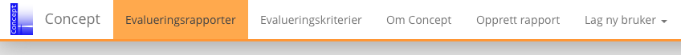

## 2 Bevege seg rundt i systemet

Systemet skal være relativt enkelt å navigere seg rundt i. Det finnes ikke mange sorte hull man kan falle ned i, men det finnes et par ubehagelige sidegater likevel. Denne seksjonen skal gi et kort overblikk over hvordan lekeplassen ser ut, og hjelpe deg å kjenne igjen farlige fallgruver som kan ende i banning, ergrelser og vel så det.

<em>Meny for enkel navigasjon.</em>

I figuren over ser du mulighetene dine, i form av en enkel meny. Denne er det like så godt å bli venn med, først som sist. Vi kommer mest til å se på seksjonene `Evalueringsrapporter` og `Opprett rapport`. De resterende seksjonene er bare seksjoner som viser viktige tekster, uten muligheter for å rote seg bort. Disse kan du utforske selv. Be aware! The dogs are out.

### 2.1 Evalueringsrapporter

Dette er seksjonen som er viktigst for den vanlige brukeren. Her finnes det ulike måter å liste opp rapportene på. De kan vises som bokser, vises i tabell eller i kart. Hvis man befinner seg i boks- eller tabellvisningen vil man kunne sortere rapportene øverst til høyre, eller søke ved bruk av filter øverst til venstre.

Boksvisningen er den eneste av disse visningene man har mulighet til å komme inn i redigeringsmodus på hver og enkelt rapport. Man klikker på den grønne knappen, som det står `Rediger` på. Hvis man klikker hvor som helst ellers på en boks, kommer man inn på den enkelte rapport sin side.

<em>Boksvisning i seksjonen Evalueringsrapporter.</em>

I en hver sammenheng kan man eksportere rapportene i - den sorterte og/eller filtrerte - listen til `.csv` format. Hva er nå det for noe? Jo, det er et format som er kompatibelt med det meste, deriblant MS Excel. På de fleste maskiner åpner man bare filen og denne åpnes i et Excel-lignende program. Hvis ikke denne filen åpnes automatisk i Excel (eller hva man enn har) når man trykker på den, er det muligheter for å importere filen ved bruk av `File->Import` i menyen eller lignende.

<em>Tabellvisning i seksjonen Evalueringsrapporter.</em>

I tabellvisningsmodus kan man enkelt sortere på kolonnene ved å trykke på kolonnetittelen. En pil indikerer hvilken kolonne som sorteres på og hvilken retning verdiene stiger. På bildet over, ser man at `navn` er valgt som sorteringsattributt og at radene sorteres stigende fra topp til bunn. Nåværende sortering vises også i sorteringsknappen øverst til høyre. Hvis man klikker på en av radene kommer man inn på den enkelte rapport sin side.

<em>Kartvisning i seksjonen Evalueringsrapporter.</em>

I kartvisningen finnes ingen sorterings- eller filtreringsmuligheter. Her vises bare rapporter som har en tilegnet lokasjon. Kartet støtter det meste som `Google Maps` tilbyr, til og med gatevisning.

### 2.2 Opprett rapport

<em>Skjemaet som fylles inn for hver rapport.</em>

### 2.3 Redigere rapport

<h3 style="font-weight: 600;"> Advarsel !</h3>

Svarte hull observert i systemet. Pass på hvor du trår.

Hvis du tidligere har opprettet en rapport, og nå enten angrer eller vil tilføye informasjon, kan du endre rapporten din. Du leter da etter en redigeringsknapp et eller annet sted. Hvis man leker tampen brenner, kan det avsløres at det er veldig varmt inne i boksvisningen og inne på siden for den enkelte rapport. Knappen er grønn og det står `Rediger` på den.

Klikker du så på denne knappen kommer du til et vindu som er 99.62% identisk med vinduet som man oppretter rapporter i. Eneste forskjellen er knappene som ligger nederst på siden og hva som utføres når man klikker på disse knappene. Hvis du hoppet over den røde boksen med advarsel, er det lurt at du prøver å lese denne på nytt. Alt som er rødt skal man være skeptisk til og forsiktig med.

<em>Sletteknappen.</em>

Du finner en rød knapp nederst til venstre på siden. `Slett` står det på den. Denne ble du litt kjent med i `Opprett rapport`. Den finnes her også, og den gjør som den sier; den sletter rapporten. Ingen vei tilbake dessverre, så hvis man trykker på denne og angrer på det seinere, hjelper det ikke å ta kontakt med, de tidligere nevnte, smarte studentene.

<em>Henholdsvis avbryt- og lagreknapp.</em>

Når man har gjort de endringene man skal gjøre i de forskjellige feltene, trykker man bare på lagre, og rapporten blir lagret med de nye verdiene. Ingen tilbakestillingsfunksjonalitet (langt ord) her heller. Det som er gjort er gjort, og det som må gjøres må gjøres. Hvis du nå ikke har lyst til å lagre likevel, trykker du på `Avbryt` like ved lagre knappen. På mobile, mikroskopiske enheter kan dette være vanskelig. Lykke til!

<em>Håpløst.</em>

