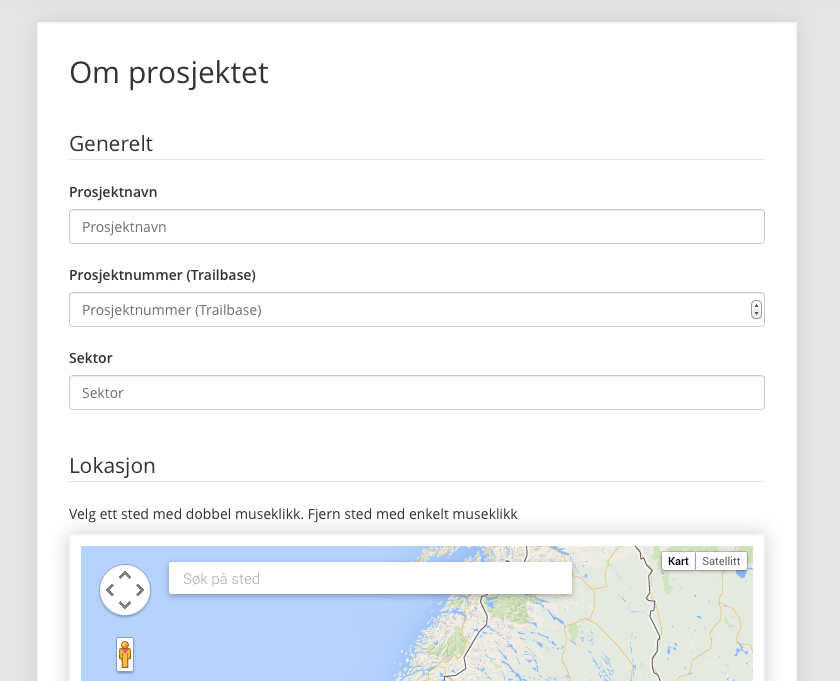
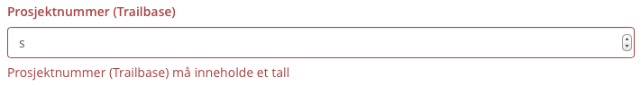
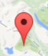
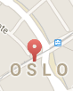
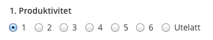
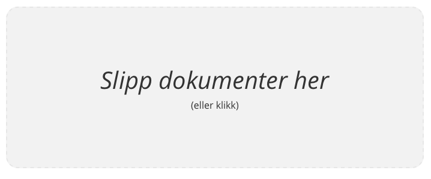
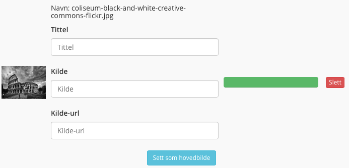
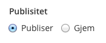
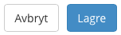

# 3 Opprett og rediger rapport

### 3.1 Opprett rapport

Dette er vel den lengste siden i systemet. Det loves kake til den som fullfører denne innføringen.

<em>Skjemaet som fylles inn for hver rapport.</em>

Når du kommer inn på siden, listes det opp en rekke felter som man bør fylle inn. Det er noen som er obligatoriske, og andre ikke. Du får beskjed om du mangler noen felter. Det anbefales å fylle ut flest mulige felter, da dette hjelper til med å opprettholde estetiske og konsistente rapportsider.

<em>Feilmeldinger i skjemaet. Her er en bokstav lagt inn istedet for et tall.</em>

Det finnes seks forskjellige typer felter. Vi har blant annet tekstfelter og tallfelter. Disse er veldig like, men den ene av dem godtar bare tall. Man kan ofte se en liten forskjell på dem, da tallfelter har som oftest et par små piler på høyre side. Dette er dessverre bestemt av nettleseren, og varierer en del fra nettleser til nettleser. Ikke bekymre deg, kjære venn, systemet sier i fra hvis det er ugler i mosen.

<em>Kart som man kan søke og velge lokasjon i.</em>

Ellers har vi en større variant av et tekstfelt, der du skriver inn lengre tekster. Her får du lov til å gjøre ganske mye forskjellig, som for eksempel å lage linjeskift slik at du får delt teksten opp i avsnitt. Dette gjør du på vanlig måte, ved å trykke Retur-knappen to ganger. (Retur = Enter)

<em>Markør i kartet.</em>

Ganske langt oppe på siden ligger et kart, der du kan søke etter steder og vedlegge lokasjon i rapporten. Ved å skrive inn i søkeboksen, dulter det opp et par forslag til steder i nærheten. Hvis du klikker på et av disse alternativene, kommer du til dette stedet i kartet. Herifra kan du klikke der du vil at posisjonen skal være, og systemet tar så vare på posisjonen. Du ser da at det dukker en markør opp i kartet.

<em>Feil markør.</em>

Det finnes to forskjellige markører som kan dukke opp i kartet. Den ene er som tidligere, som når du velger lokasjon, og den andre kommer når man søker etter steder i søkeboksen. Ta en god titt på vedlagte bilder.

Hvis du vil endre lokasjonen, må du først dobbeltklikke på den daværende markøren for å fjerne den, og deretter klikke der du vil ha den nye lokasjonen.

<em>Felt for tallevalueringer.</em>

Lenger nede på denne siden skal du velge tallverdier for evalueringen. Disse verdiene ligger i skiktet 1-6, men kan også velges å utelates i spesielle tilfeller. Det kan f.eks. hende at samfunnsøkonomisk lønnsomhet ikke er evaluert på grunn av at det ikke er vurderbart med de tilgjengelige dataene. Da velger man `Utelatt` i dette feltet, og tallverdiene for dette kriteriet blir ikke med i spider-diagrammet.

<em>Opplastingsfelt for dokumenter.</em>

For å gjøre rapporten mer interessant for normale nettsurfere, kan det være lurt å legge ved bilde- og dokumentfiler. Det ligger to felter nederst på siden der man kan laste opp disse filene. Man klikker enten på feltet eller drar filene over feltet og slipper. Hvis man klikker på feltet, velger man filene man vil laste opp. Det kan lastes opp flere filer samtidig. Merk at det er to forskjellige felter; et for dokumenter og et for bilder. I dokumentfeltet er bare `.pdf` og vanlige `MS Office`-dokumenter velkomne, som vil si at resten vil bli avslått. I bildefeltet lastes bare bilder opp. Så hvis ingenting skjer når du velger en fil, er det antageligvis på grunn av at du holder på i feil felt og prøver f.eks. å laste opp et dokument i bildefeltet.

<em>Tilleggsinformasjon for hver fil.</em>

Når du har valgt filer som skal lastes opp, vil de dukke opp over opplastningsfeltet. Her vises progresjon av opplastning per fil. Det vises også navn og en del felter man kan fylle ut for hver og enkelt fil. Hvis man angrer på å ha lastet opp en fil, kan man klikke den røde "sletteknappen" på den høyre siden. Det velges automatisk et bilde som hovedbilde, men det kan endres ved å klikke den blå knappen som det står `Sett som hovedbilde` på.

<em>Publiseringsvalg.</em>

Til slutt har man alternativet mellom å skjule eller publisere rapporten. Det kan hende du ikke er helt ferdig og ønsker å gjøre et par endringer før man publiserer. Du kan da trykke på `Gjem`, og deretter `Lagre` eller `Opprett`. Dette kan endres seinere på samme måte.

Da var vi ferdige med dette dråget av en side. Da er det bare å fylle opp kaffekoppen og sette seg ned å skrive! ;-)

PS. kaken var en løgn.

### 3.2 Redigere rapport

<h3 style="font-weight: 600;"> Advarsel !</h3>

Svarte hull observert i systemet. Pass på hvor du trår.

Hvis du tidligere har opprettet en rapport, og nå enten angrer eller vil tilføye informasjon, kan du endre rapporten din. Du leter da etter en redigeringsknapp et eller annet sted. Hvis man leker tampen brenner, kan det avsløres at det er veldig varmt inne i boksvisningen og inne på siden for den enkelte rapport. Knappen er grønn og det står `Rediger` på den.

Klikker du så på denne knappen kommer du til et vindu som er 99.62% identisk med vinduet som man oppretter rapporter i. Eneste forskjellen er knappene som ligger nederst på siden og hva som utføres når man klikker på disse knappene. Hvis du hoppet over den røde boksen med advarsel, er det lurt at du prøver å lese denne på nytt. Alt som er rødt skal man være skeptisk til og forsiktig med.

<em>Sletteknappen.</em>

Du finner en rød knapp nederst til venstre på siden. `Slett` står det på den. Denne ble du litt kjent med i `Opprett rapport`. Den finnes her også, og den gjør som den sier og sletter i dette tilfellet rapporten. Ingen vei tilbake dessverre, så hvis man trykker på denne og angrer på det seinere, hjelper det ikke å ta kontakt med, de tidligere nevnte, smarte studentene.

<em>Henholdsvis avbryt- og lagreknapp.</em>

Når man har gjort de endringene man skal gjøre i de forskjellige feltene, trykker man bare på lagre, og rapporten blir lagret med de nye verdiene. Ingen tilbakestillingsfunksjonalitet (langt ord) her heller. Det som er gjort er gjort, og det som må gjøres må gjøres. Hvis du nå ikke har lyst til å lagre likevel, trykker du på `Avbryt` like ved lagre knappen. På mobile, mikroskopiske enheter kan dette være vanskelig. Lykke til!

<em>Håpløst.</em>

