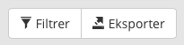
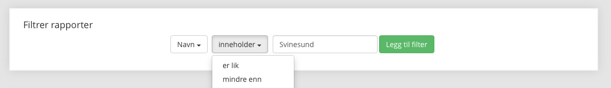
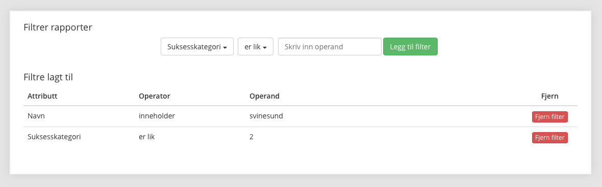

## 4 Filtrer og eksporter (for superbrukeren)

Trykker man på Filtrer-knappen inne på Evalueringsrapporter får man opp muligheten til å legge inn filtre.

<em>Filterknappen til venstre.</em>

### 4.1 Legg til filter

Man må velge attributt, operator og operand før man kan trykke på Legg til filter. De ulike attributtene er datafelter som ligger i databasen. Operatorer er "inneholder", "er lik", "mindre enn" og "større enn". Operand er verdien man skal søke på. Systemet gir beskjed dersom attributt og operator ikke passer sammen. For eksempel kan ikke et navn være mindre enn en annen verdi. Man kan legge til flere slike filtre for å hente ut akkurat det man vil fra databasen.

<em>Legg til filter.</em>

### 4.2 Fjern filter

Trykk på den røde Fjern filter-knappen i filtertabellen.

<em>Liste med valgte filtre.</em>

### 4.3 Eksporter data til Excel

Et trykk på Eksporter-knappen laster ned en csv-fil som kan åpnes i Excel. All informasjon som ligger i databasen bortsett fra bilder og referanser kommer med i denne filen. Dersom man ønsker å fjerne felter og gjøre andre ting med dataen må man gjøre dette selv med filen man har lastet ned. Eksporteringsmuligheten er kun for å hente all informasjon fra databasen på en enkel måte.

Når man har valgt Tabell som visningsalternativ er det også mulig manuelt å legge til eller fjerne en rapport for eksportering. Alle valgte rapporter blir eksportert.

Husk at dersom det er over 20 rapporter blir dataen delt på flere sider og at man må navigere seg frem og tilbake. Filter-og eksporteringsfunksjonaliteten fungerer uavhengig av flere sider.

Siden komma og ikke punktum er desimalskilletegn i Norge er det viktig at man har norsk tegnsett i Excel slik at csv-filen importeres riktig.

### 4.3 Eksporter rapport som pdf-dokument

Hvis man vil kan man eksportere rapporter hver for seg, som pdf-dokument. Man må være logget inn, og gå til en spesifikk rapport. Der inne finnes det en eksportèr-knapp. Denne blir aktiv når filen er klar for nedlastning. Klikk så på denne eksportèr-knappen. Internet Explorer vil ikke eksportere spider-diagram, da denne nettleseren ikke tilfredstiller visse funksjonelle krav.
